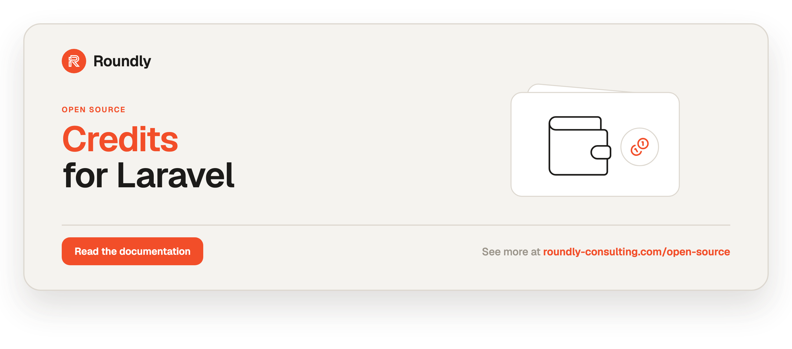

<!-- roundly-hero:start -->
<p align="center">
  <a href="https://roundly-consulting.com/open-source/docs/credits-for-laravel?utm_source=github&utm_medium=readme&utm_campaign=open-source&utm_content=credits-for-laravel">
    
  </a>
</p>
<!-- roundly-hero:end -->

# Credits for Laravel

Manage credits / wallet balance on any Eloquent entity. Each credit change is stored as an
immutable, time-stamped ledger row (positive to grant, negative to deduct), and an entity's
balance is the sum of its rows — optionally as of a point in time.

## Requirements

- PHP 8.4
- Laravel 12 or 13
- [`roundly-consulting/package-toolkit-for-laravel`](https://github.com/roundly-consulting/package-toolkit-for-laravel)
  (the shared package bootstrapper — a hard dependency, installs automatically)

## Installation

Install the package via Composer:

```bash
composer require roundly-consulting/credits-for-laravel
```

Publish and run the migration. The package does **not** auto-load it — publishing copies the
`credits` migration into your `database/migrations`, where you own it, so a bare
`php artisan migrate` before publishing creates nothing:

```bash
php artisan vendor:publish --tag="credits-migrations"
php artisan migrate
```

Optionally publish the config file:

```bash
php artisan vendor:publish --tag="credits-config"
```

Optionally publish the translations:

```bash
php artisan vendor:publish --tag="credits-translations"
```

## Configuration

The published config file lives at `config/credits.php`:

```php
<?php

declare(strict_types=1);

use RoundlyConsulting\Credits\Models\Credit;

return [

    'model' => Credit::class,

    'primary_key_type' => env('CREDITS_PRIMARY_KEY_TYPE', 'bigint'),

    'allow_overdraft' => env('CREDITS_ALLOW_OVERDRAFT', false),

    'minimum_balance' => 0,

    'default_bucket' => 'default',

    'scale' => 0,

    'rounding' => PHP_ROUND_HALF_UP,

    'modifiable' => [
        //
    ],

];
```

| Key | Type | Default | Env | Purpose |
|---|---|---|---|---|
| `model` | `class-string<RoundlyConsulting\Credits\Models\Credit>` | `Credit::class` | — | The Eloquent model used to store credit rows. Override with your own subclass to customise behaviour or the table. |
| `primary_key_type` | `string` | `'bigint'` | `CREDITS_PRIMARY_KEY_TYPE` | The primary-key strategy of the `credits` table: `bigint`, `uuid` or `ulid`. Fixed when the migration first runs. See [Key types](#key-types). |
| `allow_overdraft` | `bool` | `false` | `CREDITS_ALLOW_OVERDRAFT` | When `false`, a deduction that would take the balance below `minimum_balance` is rejected with an `InsufficientCreditsException`. Set `true` to permit negative balances globally. |
| `minimum_balance` | `int` | `0` | — | The floor enforced when overdraft is disallowed. |
| `default_bucket` | `string` | `'default'` | — | The bucket used for reads and writes when a call omits one. A bucket-less balance query returns this bucket's balance only — it does not sum across buckets. See [Named buckets](#named-buckets). |
| `scale` | `int` | `0` | — | The number of decimal places the stored integer encodes (the integer-minor-unit convention for fractional credits). Used by the display helpers. See [Displaying balances](#displaying-balances). |
| `rounding` | `int` | `PHP_ROUND_HALF_UP` | — | Default rounding mode for the display helpers when a requested display scale is smaller than the stored scale. One of `PHP_ROUND_HALF_UP`, `PHP_ROUND_HALF_DOWN`, `PHP_ROUND_HALF_EVEN` (banker's), or `PHP_ROUND_HALF_ODD`. Overridable per call. |
| `modifiable` | `array<Closure>` | `[]` | — | Resolvers invoked by the `credits:modify` command. Each closure receives a `$modify` callback that applies the requested change to a `Creditable` entity. |

The package ships with sensible defaults and works with **zero** host configuration.

### Key types

`primary_key_type` sets the type of the `credits` table's own `id` column, and the model
follows it — `bigint` (auto-incrementing, the default), `uuid` or `ulid`. It is read when
the migration runs, so choose it **before** you publish and migrate; changing it afterwards
is a data migration, not a config change.

The default is `bigint` for a reason worth understanding before you change it. A `Credit` is
a thing other packages point *at* polymorphically, and a Laravel morph column
(`$table->morphs('subject')`) is an unsigned bigint. On a strict engine such as PostgreSQL,
a `uuid` credit id will not go into one:

```
SQLSTATE[22P02]: invalid input syntax for type bigint: "019f6f33-22b8-737f-a581-849e7cdc517a"
```

SQLite will **not** warn you about this — its type affinity stores the string in an integer
column silently, so a green SQLite suite proves nothing here.

> **Constraint:** this assumes every morph target in your application shares one key type.
> If you set `CREDITS_PRIMARY_KEY_TYPE=uuid`, the models on the other end of your
> polymorphic relations need to be uuid-keyed too, and the packages owning those columns
> need to agree. A mixed application — a `uuid` `Credit` and a `bigint` `Comment` both
> pointed at by the same morph column — is not supported by this package, by Laravel's own
> `morphs()`/`uuidMorphs()` split, or by anything else. Pick one key type per application.

## Usage

### Make a model creditable

Add the `HasCredits` trait to any Eloquent model. Implementing the `Creditable` interface is
optional but recommended so the contract is explicit (the `credits:modify` command depends on
it).

```php
use Illuminate\Database\Eloquent\Model;
use RoundlyConsulting\Credits\Interfaces\Creditable;
use RoundlyConsulting\Credits\Traits\HasCredits;

final class User extends Model implements Creditable
{
    use HasCredits;
}
```

### Grant and deduct credits

`modifyCredits()` appends a ledger row. Use a positive amount to grant, a negative amount to
deduct. The optional `$description` and `$meta` are stored on the row.

```php
$user->modifyCredits(100, 'signup bonus');
$user->modifyCredits(-30, 'purchase', ['order_id' => 42]);
```

`modifyCredits()` returns the recorded `Credit` row.

### Overdraft protection

By default a deduction that would drive the balance below `minimum_balance` (zero by default)
is **rejected** with an `InsufficientCreditsException` — balances cannot silently go negative.

```php
use RoundlyConsulting\Credits\Exceptions\InsufficientCreditsException;

try {
    $user->modifyCredits(-1000, 'big purchase');
} catch (InsufficientCreditsException $e) {
    // $e->requested and $e->available carry the numbers; $e->creditable is the entity.
}
```

Allow a negative balance for a single call with `allowOverdraft`, or globally via the
`allow_overdraft` config / `CREDITS_ALLOW_OVERDRAFT` env var:

```php
$user->modifyCredits(-1000, 'manual debit', allowOverdraft: true);
```

The read-then-write is wrapped in a database transaction with a row-level lock
(`lockForUpdate`), so concurrent deductions cannot both breach the floor.

### Read the balance

```php
$user->creditsBalance();            // 70

// Balance as of a point in time:
$user->creditsBalance(now()->subWeek());
```

### Check available credits

```php
$user->hasCredits();        // true if balance >= 1
$user->hasCredits(100);     // true if balance >= 100
$user->hasCredits(100, now()->subWeek());
```

### Set an exact balance

`setCreditsTo()` computes the delta from the current balance and records a single adjusting
row (it does nothing if the balance already matches).

```php
$user->setCreditsTo(500, 'manual adjustment');
```

### Access the ledger

`credits()` is a standard `MorphMany` relationship, so you can query the underlying rows:

```php
$user->credits()->latest()->get();
```

### Named buckets

Credits can be split into independent, named pools on the same entity — for example
`promotional` and `purchased` credit that should never be spent against each other. Every
write and read method accepts an optional `bucket` argument.

```php
$user->modifyCredits(100, 'welcome promo', bucket: 'promotional');
$user->modifyCredits(50, 'top-up', bucket: 'purchased');

$user->creditsBalance(bucket: 'promotional'); // 100
$user->creditsBalance(bucket: 'purchased');   // 50
```

Balances are fully isolated per bucket, and the overdraft guard is enforced **per bucket** —
a deduction against the `purchased` bucket cannot draw on `promotional` credit.

When you omit the bucket, the configured `default_bucket` (`'default'`) is used for **both**
reads and writes. A bucket-less balance query therefore returns the default bucket's balance
only; it does **not** sum across every bucket:

```php
$user->modifyCredits(25);          // lands in the 'default' bucket
$user->creditsBalance();           // 25  (the default bucket only)
$user->creditsBalance(bucket: 'promotional'); // 100
```

Existing single-pool usage is unchanged: every call without a bucket continues to operate on
one pool (the `default` bucket). `setCreditsTo()` and `hasCredits()` accept the same `bucket`
argument, and the `credits:modify` command exposes a `--bucket=` option.

#### Totals across buckets

When you do want a combined figure, sum across several named buckets or across every bucket
the entity owns:

```php
// Sum a chosen set of buckets (names are de-duplicated; an empty list returns 0).
$user->creditsBalanceForBuckets(['promotional', 'purchased']); // 150

// Sum every bucket on the entity.
$user->totalCreditsBalance(); // 175

// Both accept an optional point-in-time argument.
$user->totalCreditsBalance(now()->subWeek());
```

### Fractional credits (scale)

Credits are stored as whole integers to avoid floating-point drift. To represent fractional
credits, treat the stored value as **minor units** and set `scale` in the config to the number
of decimal places they represent. For example, with `scale = 2` a stored value of `150`
represents `1.50` credits — store and deduct the minor units, and use the display helpers
below to render them. Storage stays an integer (`bigInteger`) and the core math is unchanged.

### Displaying balances

The display helpers turn an integer minor-unit amount into a **locale-free plain decimal
string** using the configured `scale`. They apply no thousands separators or locale
formatting — wrap the result with [`Illuminate\Support\Number`](https://laravel.com/docs/helpers#numbers)
yourself if you need that.

```php
config(['credits.scale' => 2]);

$user->modifyCredits(123450); // stores 123450 minor units

$user->displayCreditsBalance();      // "1234.50"  (a single bucket's balance)
$user->displayCredits(123450);       // "1234.50"  (format any integer amount)
```

`displayCredits()` and `displayCreditsBalance()` take an optional per-call `scale` override
(the number of decimal places to render) and an optional `rounding` mode. When the requested
display scale is **smaller** than the stored scale, the dropped digits are rounded using the
mode — defaulting to `config('credits.rounding')` (`PHP_ROUND_HALF_UP`):

```php
$user->displayCredits(123450, scale: 0);                          // "1235"  (rounded half-up)
$user->displayCredits(123450, scale: 0, rounding: PHP_ROUND_HALF_DOWN); // "1234"
$user->displayCredits(-123450);                                   // "-1234.50"
```

Multi-bucket display composes from the totals above — there are no dedicated display-total
methods:

```php
$user->displayCredits($user->totalCreditsBalance());                       // formatted grand total
$user->displayCredits($user->creditsBalanceForBuckets(['promotional', 'purchased']));
```

The reusable formatting core is `RoundlyConsulting\Credits\Actions\FormatCreditsAction`
(`execute(int $amount, ?int $scale = null, ?int $rounding = null): string`), which the trait
methods delegate to.

### Query scopes

The `Credit` model ships query scopes for reporting over the ledger:

```php
use RoundlyConsulting\Credits\Models\Credit;

Credit::query()->grants()->get();              // amount > 0
Credit::query()->deductions()->get();          // amount < 0
Credit::query()->upTo(now()->subWeek())->get(); // created_at <= $at
Credit::query()->forCreditable($user)->get();   // rows owned by $user
Credit::query()->bucket('promotional')->get();  // rows in a named bucket
Credit::query()->buckets(['promotional', 'purchased'])->get(); // rows in any listed bucket
```

### Events

A `RoundlyConsulting\Credits\Events\CreditsModified` event is dispatched after every recorded
change (no event fires when `setCreditsTo()` is a no-op). It carries the `creditable`, the new
`Credit` row, and the resulting `balance`.

```php
use Illuminate\Support\Facades\Event;
use RoundlyConsulting\Credits\Events\CreditsModified;

Event::listen(function (CreditsModified $event): void {
    // $event->creditable, $event->credit, $event->balance
});
```

### Actions (advanced usage)

The trait delegates to single-purpose actions you can resolve and call directly (for example
from a job or a service). Each takes a DTO / model and has a single `execute()` method:

```php
use RoundlyConsulting\Credits\Actions\ModifyCreditsAction;
use RoundlyConsulting\Credits\Actions\SetCreditsAction;
use RoundlyConsulting\Credits\Actions\GetCreditsBalanceAction;
use RoundlyConsulting\Credits\DataTransferObjects\CreditChangeData;

app(ModifyCreditsAction::class)->execute($user, new CreditChangeData(
    amount: -30,
    description: 'purchase',
    meta: ['order_id' => 42],
    allowOverdraft: false,
));

app(SetCreditsAction::class)->execute($user, 500, 'manual adjustment');
app(GetCreditsBalanceAction::class)->execute($user);
```

Bind your own implementation in the container to customise behaviour without forking.

### Console command

`credits:modify` applies a credit change in bulk to every entity resolved by the
`credits.modifiable` config. Register one or more resolver closures:

```php
// config/credits.php
use Closure;

'modifiable' => [
    function (Closure $modify): void {
        User::query()->each(fn (User $user) => $modify($user));
    },
],
```

Then run:

```bash
php artisan credits:modify --amount=10 --description="monthly bonus"
```

| Option | Default | Description |
|---|---|---|
| `--amount` | `0` | The credit amount to apply (must be an integer; may be negative). A non-integer value fails with a non-zero exit code. |
| `--description` | `null` | An optional human-readable description stored on each row. |
| `--bucket` | configured default | The named bucket to apply the change to. Omit to use the configured `default_bucket`. |
| `--allow-overdraft` | `false` | Permit deductions that drive the balance below zero. |

Resolved entities that are not `Creditable` models are skipped with a warning rather than
failing the run.

### Concurrency

The balance is never a stored column — it is the sum of an append-only ledger. A deduction
runs inside a transaction that reads the ledger under `lockForUpdate()` before the overdraft
guard decides, so two racing debits serialise and the second cannot overdraw. Because every
change is written as a new delta row (never an absolute balance), a change that lands between
the balance read and the write is folded in, never lost.

### Inspecting the configuration

```bash
php artisan about --only=credits
```

Reports the resolved model, the overdraft policy, the minimum balance, the default bucket, the
scale, and how many `modifiable` resolvers are registered (a count — never what they resolve).

## Testing

```bash
composer test
```

## Changelog

Please see [CHANGELOG](CHANGELOG.md) for more information on what has changed recently.

## Contributing

Please see [CONTRIBUTING](CONTRIBUTING.md) for details.

## Security Vulnerabilities

Please review [our security policy](../../security/policy) on how to report security
vulnerabilities.

## Credits

- [Andrej Mihaliak](https://github.com/mihaliak)
- [All Contributors](../../contributors)

## License

The MIT License (MIT). Please see [License File](LICENSE.md) for more information.
